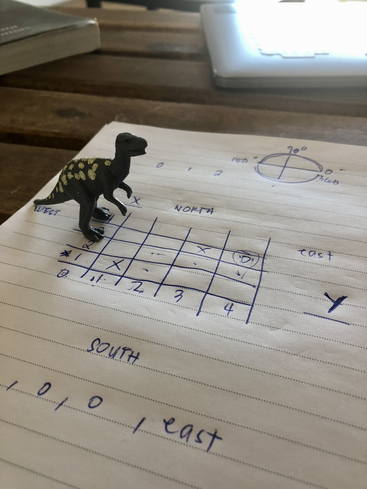
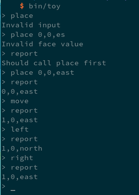

# Dinobot Robot Simulator 🦖



## Usage

Open a console and execute `php bin/toy`, a prompt character (`> `) will be shown.
Available command:

- `place x,y,face` \
  will put the toy robot on the table in position `x`, `y` and facing `north`, `south`, `east`, or `west`. This command should called first before another command. You cannot place a toy robot beyond the barrier.
- `move` \
  will move the toy robot one unit forward in the direction it is currently facing.
- `left` or `right` \
  will rotate the robot 90 degrees in the specified direction without changing the position of the robot.
- `path` \
  will give the path to take from the current position to a specific destination. e.g. `path 0,1`
- `q` \
  Exit the prompt.

Example:\


## Development

1. Fork and clone this repo.
```console
git clone git@github.com:pH-7/dinobot-on-tabletop-game.git
```
2. Install all dependencies
   ```console
   composer install
   ```
3. Install development tools using `phive`
   ```console
   phive install
   ```
4. Before commit the change, make sure there are no coding style or `phpstan` violations by executing
   ```console
   vendor/bin/phpcs
   tools/phpstan analyse
   ```
5. Run unit testing by executing
   ```console
   php bin/phpunit
   ```
6. Unit testing coverage report
   ```console
   php bin/phpunit --coverage-text
   ```
